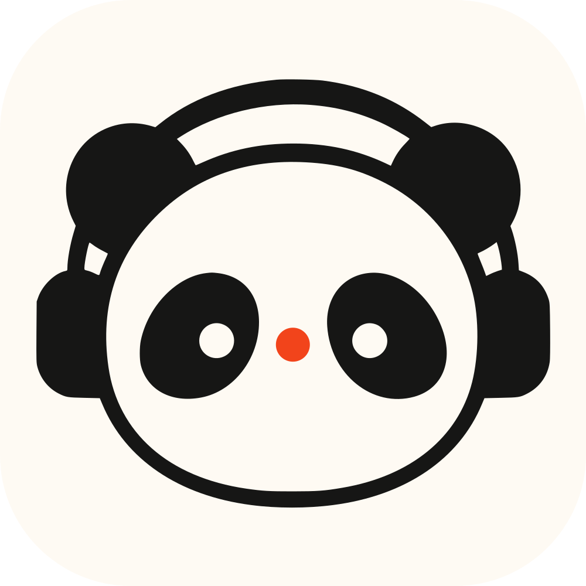
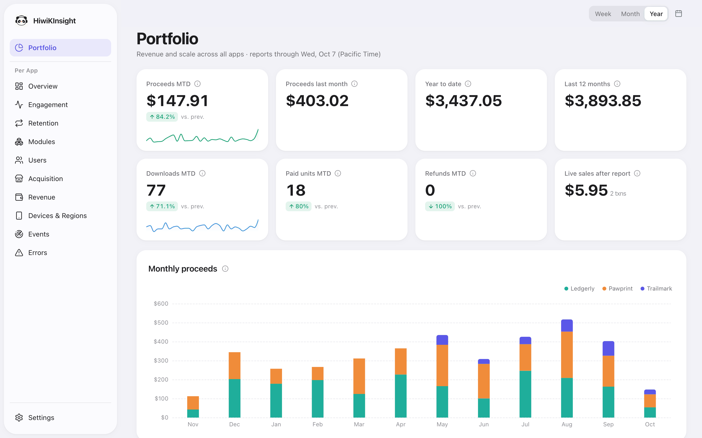
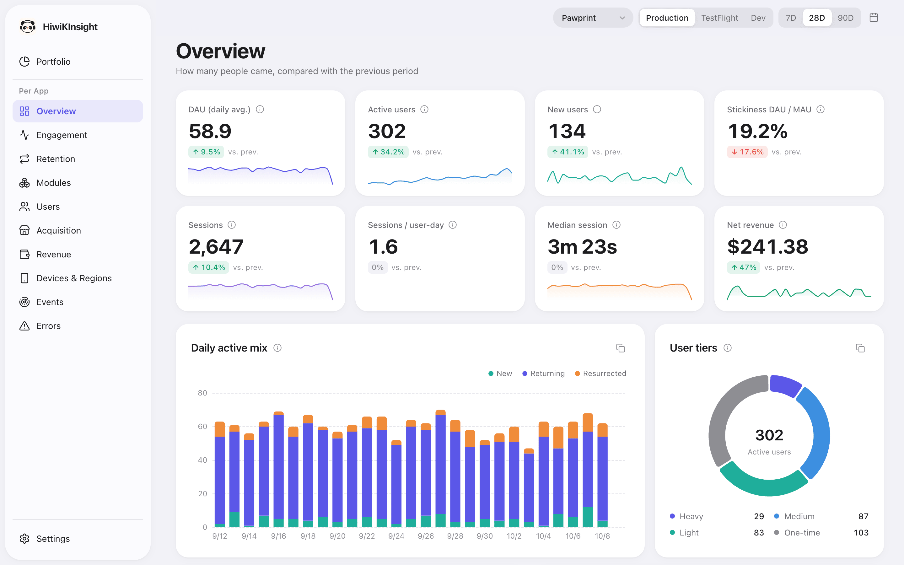
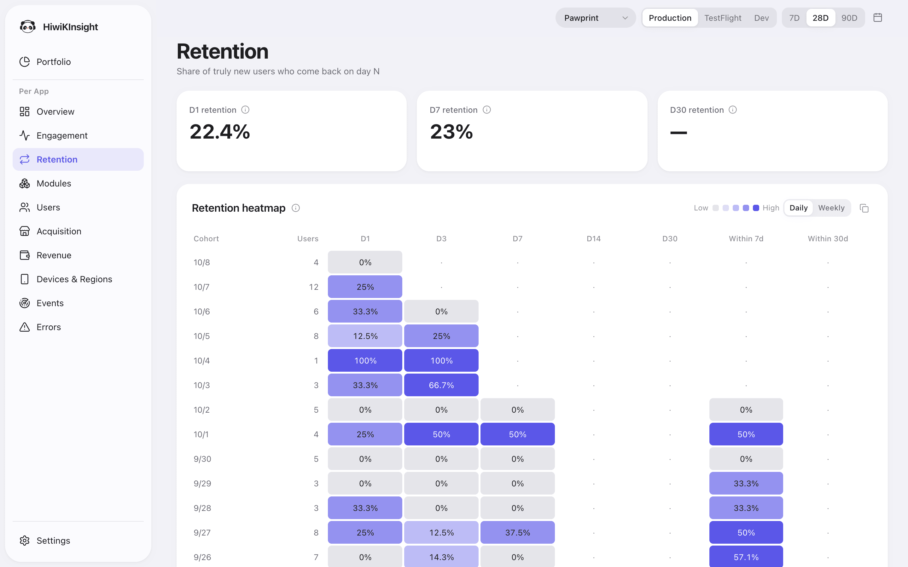
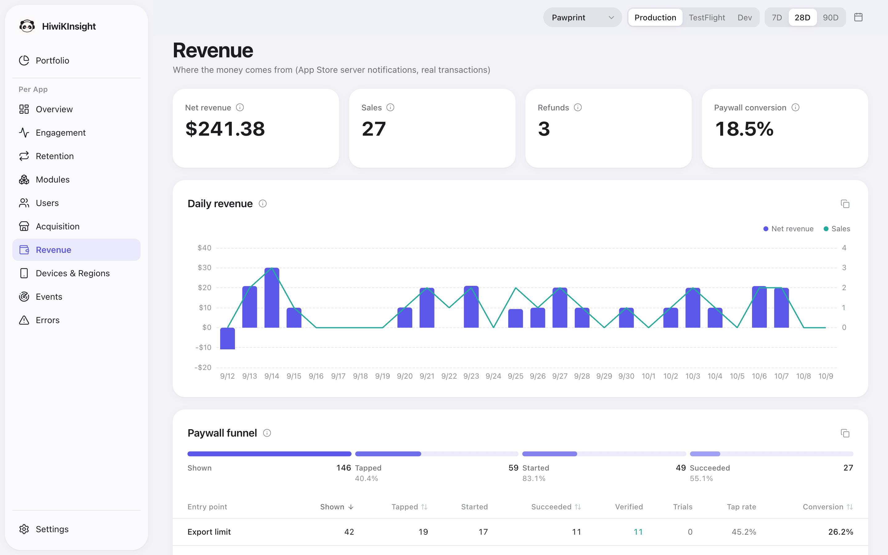

<p align="center">
  
</p>

<h1 align="center">HiwiKInsight</h1>

<p align="center"><strong>Self-hosted product analytics and App Store revenue for indie iOS developers, built to be queried by AI agents as well as people.</strong></p>

<p align="center">
  <a href="https://github.com/RedHiwiK/HiwiKInsight/actions/workflows/ci.yml"></a>
  
  
  
  
  <a href="LICENSE"></a>
</p>

<p align="center">
  <a href="#try-it-in-60-seconds">Try the demo</a> · <a href="docs/getting-started.md">Getting started</a> · <a href="docs/ai-integration.md">AI integration</a> · <a href="https://github.com/RedHiwiK/hiwikinsight-ios">iOS SDK</a> · <a href="README.zh-CN.md">简体中文</a>
</p>

HiwiKInsight is one Go binary with an embedded SQLite database (pure Go, no cgo). It receives anonymous usage events from the [HiwiKInsightKit](https://github.com/RedHiwiK/hiwikinsight-ios) Swift SDK, verifies App Store Server Notifications V2 in real time (and links each purchase to the paywall that drove it), syncs App Store Connect sales and analytics reports, and serves a web dashboard, email reports, alerts, and a read-only query layer that Claude, Cursor or any MCP client can use directly. No third-party analytics service ever sees your users' data.



## Try it in 60 seconds

```bash
git clone https://github.com/RedHiwiK/HiwiKInsight.git
cd HiwiKInsight
docker compose -f docker-compose.demo.yml up --build
```

Open http://localhost:8080/dashboard/ and sign in with `demo` / `demo`. The demo has three sample apps and 90 days of generated data. The query API accepts the token `demo-token`:

```bash
curl -s -H "Authorization: Bearer demo-token" http://localhost:8080/v1/query/describe | head -40
curl -s -H "Authorization: Bearer demo-token" "http://localhost:8080/v1/query/metric/retention?app=pawprint"
```

Without Docker (Go 1.26+, Node 22, pnpm 10): `make demo`.

## Features

- **Anonymous event analytics.** Install, session, screen, launch-source, purchase and error events from the Swift SDK; random per-install ids, no personal data, no IP addresses.
- **Real-time revenue.** App Store Server Notifications V2 with full JWS verification, an email for every transaction, refunds netted out, amounts converted to your base currency.
- **Purchase attribution.** The SDK passes a UUID as StoreKit's `appAccountToken`; when Apple's notification arrives, HiwiKInsight knows which paywall, product, app version and install day led to the purchase.
- **App Store Connect sync.** Sales reports (proceeds after commission, downloads, refunds; up to 365 days of daily and 36 months of monthly history) and analytics reports (impressions, product page views and first-time downloads by source and country).
- **15 built-in metrics with fixed definitions.** DAU/WAU/MAU and stickiness, active-day distribution, retention cohorts of truly new users, new/returning/resurrected/churned users, module and screen usage, paywall funnel, revenue attribution, device/OS/region distribution, sessions, user tiers, event trends, errors, a portfolio across all apps and the store conversion funnel. See [docs/metrics.md](docs/metrics.md).
- **Web dashboard.** 13 pages, English and Chinese, light and dark mode, display-currency switching, sign-in with bcrypt passwords.
- **Email reports and alerts.** Daily and weekly reports; alerts for failed purchases, payment errors, new or spiking errors, stale App Store Connect reports and apps that stop sending events.
- **AI-native query layer.** A `describe` endpoint that documents tables, views, conventions, event catalogs and metrics; metric, SQL and user endpoints; the `insight` CLI; a built-in MCP server (`insight mcp`); and a Claude Code skill. All of it is read-only.
- **Easy to operate.** One static binary or one container, one YAML file, one SQLite file to back up.

## Screenshots

From the demo (`make demo`): three fictional apps with 90 days of generated data.

| Overview | Retention | Revenue |
|---|---|---|
|  |  |  |

## Architecture

```
  iOS / macOS app                       Apple                       Apple
  (HiwiKInsightKit)           App Store Server Notif. V2     App Store Connect API
        |                               |                    (sales + analytics reports)
        | POST /v1/events               | POST /v1/appstore/notifications     ^
        v                               v                                     | pulled every 6 h
  +-----------------------------------------------------------------------------------+
  |  hiwikinsight (single Go binary)                                                  |
  |                                                                                   |
  |   ingest ---> write queue ---> SQLite (WAL, one writer) <--- App Store Connect    |
  |   notify (verify JWS, attribute, email) ---^        |              sync           |
  |                                                     | read-only connection pool   |
  |   daily/weekly reports + alerts (email) <-----------+                             |
  |   query API /v1/query/* <---------------------------+                             |
  |   dashboard /dashboard/ (embedded React app, reads the query API)                 |
  +-----------------------------------------------------------------------------------+
        ^                          ^                           ^
        | browser                  | insight CLI, curl         | insight mcp (stdio)
       you                      scripts, agents          Claude Code, Claude Desktop, Cursor
```

Details: [docs/architecture.md](docs/architecture.md).

## Quick start for real use

You need a server with a public HTTPS host name (for example `insight.example.com`), because both the SDK and Apple must reach it.

### Docker Compose with Caddy (automatic HTTPS)

```bash
git clone https://github.com/RedHiwiK/HiwiKInsight.git && cd HiwiKInsight
mkdir -p config && cp -r examples/catalogs config/    # sample event catalogs; replace with your own
cp examples/config.example.yaml config/config.yaml    # edit apps, timezone, currency, users
cp deploy/.env.example .env                           # set DOMAIN and the secrets
docker run --rm -it ghcr.io/redhiwik/hiwikinsight:latest hash-password
docker compose run --rm hiwikinsight check-config
docker compose up -d
```

Inside the container the database lives in the `/data` volume, so leave `data_dir` unset in `config/config.yaml`.

### Binary with systemd

Download a release archive for your platform from [GitHub Releases](https://github.com/RedHiwiK/HiwiKInsight/releases) (it contains `hiwikinsight`, `insight` and `config.example.yaml`), follow the comments in [deploy/systemd/hiwikinsight.service](deploy/systemd/hiwikinsight.service), and put nginx ([deploy/nginx/hiwikinsight.conf](deploy/nginx/hiwikinsight.conf)) or Caddy in front of it.

Full guide, backups and upgrades: [docs/deployment.md](docs/deployment.md). A ten-minute walkthrough: [docs/getting-started.md](docs/getting-started.md).

## Integrate your app

Add the SDK with Swift Package Manager (`https://github.com/RedHiwiK/hiwikinsight-ios`), then:

```swift
import HiwiKInsightKit

// Start once at launch. The app key must be listed under apps[].key in the server config.
HiwiKInsight.start(.init(appKey: "pawprint", endpoint: URL(string: "https://insight.example.com")!)) {
    ["entry_count": "10-50", "is_pro": "true"]   // optional daily user snapshot; bucketed values only
}

// Custom events
HiwiKInsight.signal("entry.created", ["entry_type": "note"])

// Screens (SwiftUI): screen.viewed on appear, screen.left with dwell time on disappear
SettingsView().trackScreen("settings", module: "settings")

// Errors
HiwiKInsight.error(id: "sync.failed", category: "thrown-exception", message: "timeout")

// Purchase attribution: the token links Apple's notification to this paywall
let token = HiwiKInsight.beginPurchase(product: product.id, context: "paywall_onboarding")
let result = try await product.purchase(options: [.appAccountToken(token)])
```

Then set the App Store Server Notifications (Version 2) URL for production and sandbox to `https://insight.example.com/v1/appstore/notifications`. Guides: [docs/sdk-integration.md](docs/sdk-integration.md) and [docs/app-store-setup.md](docs/app-store-setup.md).

## Ask your data with AI

Install the CLI and point it at your server:

```bash
go install github.com/RedHiwiK/HiwiKInsight/cmd/insight@latest
export INSIGHT_ENDPOINT=https://insight.example.com
export INSIGHT_TOKEN=<one of query.tokens>

insight describe                                  # the semantic layer; read this first
insight metric retention --app pawprint --from 2026-09-01 --to 2026-09-30
insight sql "SELECT name, COUNT(*) FROM events WHERE day >= date(local_today(), '-6 days') GROUP BY name"
```

MCP in Claude Code:

```bash
claude mcp add hiwikinsight -e INSIGHT_ENDPOINT=https://insight.example.com -e INSIGHT_TOKEN=<token> -- insight mcp
```

MCP in Claude Desktop (`claude_desktop_config.json`), Cursor (`.cursor/mcp.json`) and other clients:

```json
{
  "mcpServers": {
    "hiwikinsight": {
      "command": "insight",
      "args": ["mcp"],
      "env": { "INSIGHT_ENDPOINT": "https://insight.example.com", "INSIGHT_TOKEN": "<token>" }
    }
  }
}
```

Claude Code skill: `cp -r skills/hiwikinsight-analytics ~/.claude/skills/`, then ask "what is our D7 retention this month?".

More: [docs/ai-integration.md](docs/ai-integration.md), [docs/cli.md](docs/cli.md), [docs/query-api.md](docs/query-api.md).

## Configuration

Everything lives in one YAML file. Start from [examples/config.example.yaml](examples/config.example.yaml); any value can come from the environment as `${NAME}` or `${NAME:-default}`. Validate with `hiwikinsight check-config -config config.yaml`. Every field is documented in [docs/configuration.md](docs/configuration.md).

## Documentation

| Document | What it covers |
|---|---|
| [Getting started](docs/getting-started.md) | Demo, first real deployment, first event |
| [Configuration](docs/configuration.md) | Every config field, defaults, environment variables |
| [Deployment](docs/deployment.md) | Docker Compose, binary + systemd, reverse proxies, backups, upgrades, security |
| [SDK integration](docs/sdk-integration.md) | Events, screens, errors, purchase attribution, environments |
| [Event catalog](docs/event-catalog.md) | Documenting your events for people and AI |
| [App Store setup](docs/app-store-setup.md) | Server notifications and the App Store Connect API |
| [Metrics](docs/metrics.md) | Every built-in metric, its parameters and output tables |
| [Query API](docs/query-api.md) | `/v1/query/*` endpoints, auth and limits |
| [CLI](docs/cli.md) | The `insight` command |
| [AI integration](docs/ai-integration.md) | CLI + skill, MCP, HTTP, prompting tips |
| [Dashboard](docs/dashboard.md) | Pages, sign-in, currencies, languages |
| [Reports and alerts](docs/reports-and-alerts.md) | Email schedule, content, alert rules |
| [Architecture](docs/architecture.md) | Components, data flow, schema, design decisions |
| [Extending](docs/extending.md) | Adding metrics, pages, alerts, config fields |
| [Privacy](docs/privacy.md) | What is and is not collected, retention |

## For AI agents

- Working **on** this repository: read [AGENTS.md](AGENTS.md) (repo map, build and test commands, conventions, how to add things).
- Working **with** a HiwiKInsight server's data: read [docs/ai-integration.md](docs/ai-integration.md). The machine-readable entry points are `insight describe` (CLI), `GET /v1/query/describe` (HTTP, returns Markdown) and the `describe` tool of `insight mcp`. Call one of them first; never guess table, column or event names.
- The query layer is read-only by construction: a single validated `SELECT`/`WITH` statement on a read-only SQLite connection.

## Privacy

The SDK sends a random install id, app/OS/device context and the events you choose. The ingest endpoint never reads or stores client IP addresses. Raw events are deleted after `retention_days` (default 365). Details: [docs/privacy.md](docs/privacy.md).

## Contributing and security

See [CONTRIBUTING.md](CONTRIBUTING.md). Report vulnerabilities privately as described in [SECURITY.md](SECURITY.md). Release notes: [CHANGELOG.md](CHANGELOG.md).

## License

MIT. See [LICENSE](LICENSE).
